# Mercatura-Frontend
The repository containing the frontend of Mercatura project. 
[Parent repository](https://github.com/nijatkazimli/Mercatura)

## Intro
Mercatura is an e-commerce website with features, including but not limited to:
- Products with specific categories
- 3 different roles: Admin, Merchandiser, Regular User
- "Playlist" logic carts &ndash; User can have multiple carts and pay them separately
- Comprehensive admin dashboard
- And many more

## Techstack
- React
- Cookies (used for logged in user info storage)
- Redux (state management)
- [Saga](https://redux-saga.js.org) &ndash; Redux side effect manager (used for the business logic handling)
- TypeScript
- CSS
- [RadixUI](https://www.radix-ui.com)
- Nginx (used for serving the static files)

## Code structure
- src
  - api &ndash; contains all the logic for the interaction between BE and FE.
  - common &ndash; contains utility functions.
  - components &ndash; contains General components or the Page components.
  - constants &ndash; contains static image paths, sort options, and roles.
  - hooks &ndash; contains AuthContext (used for interaction between Redux and Cookies) and WindowDimensions  to dynamically get window dimensions to use in components.
  - media &ndash; contains static image files.
  - redux &ndash; contains all the Redux, Saga logic, and tests and mocks for them.
  - App.tsx &ndash; the entry point to the app.

## Demo
### Home Page
The left bar contains different filtering and sorting options.
On the right of the searchbar, there is a category dropdown for filtering.
**Note:** filtering and sorting is done on the **backend** side for faster results. 
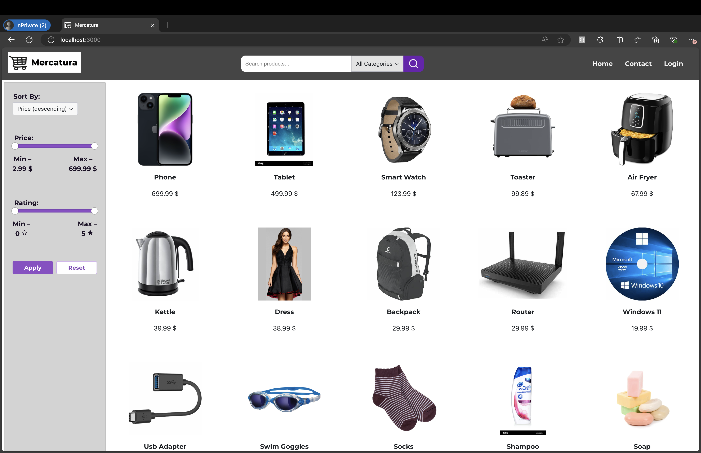 
By default, the frontend fetches 15 products. If there are more products pagination controls appear at the bottom of the home page. 
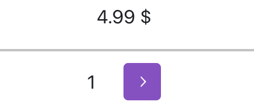

### Login Page
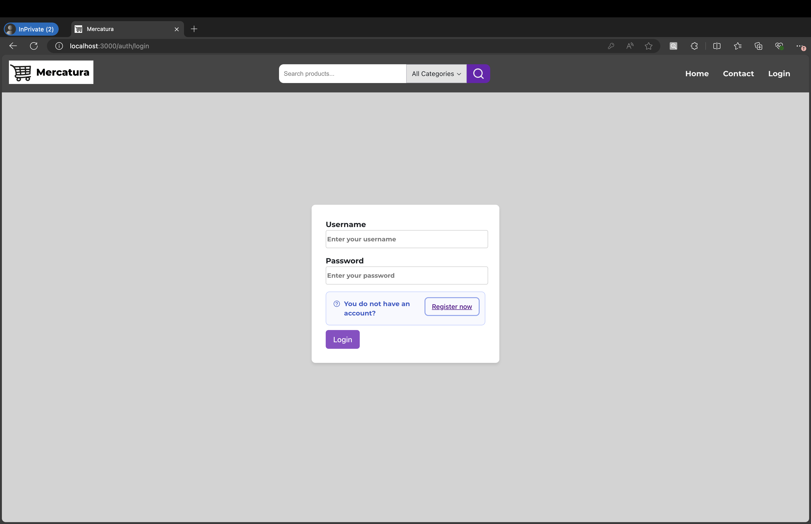 
**Note:** the user might have to relogin if he/she has stopped and restarted the backend container.

### Register Page
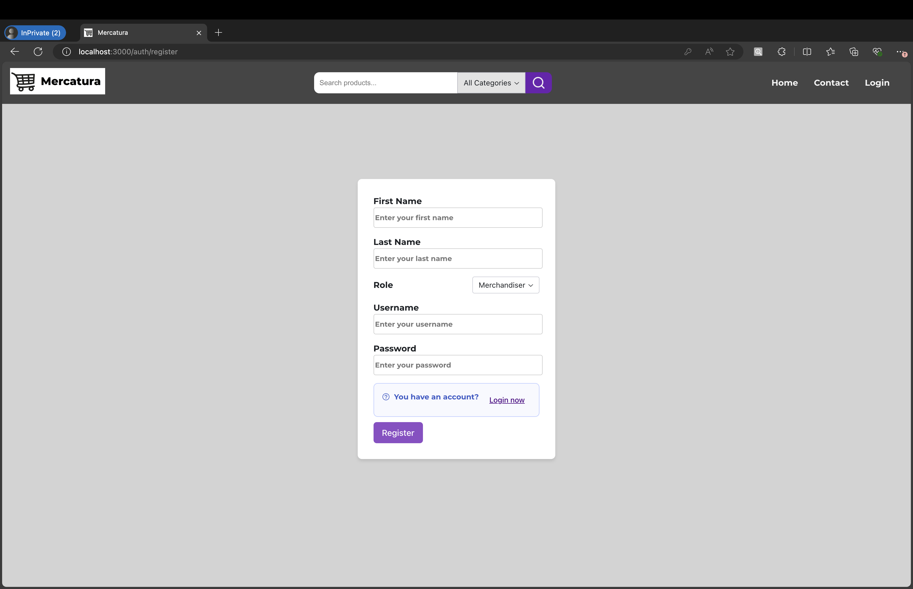 
**Note:** the user cannot register as an admin on FE. There is already an admin account created.  Credentials:  
username **admin**  
password: **password**

### Dynamic Pages
After the user logs in, based on his/her roles, he/she can see and navigate to the pages &ndash; Merchandising and Admin. 

### Product Details
Here the user can see several details about the product. 
On the right side, user always sees at most 5 products from the same category. 
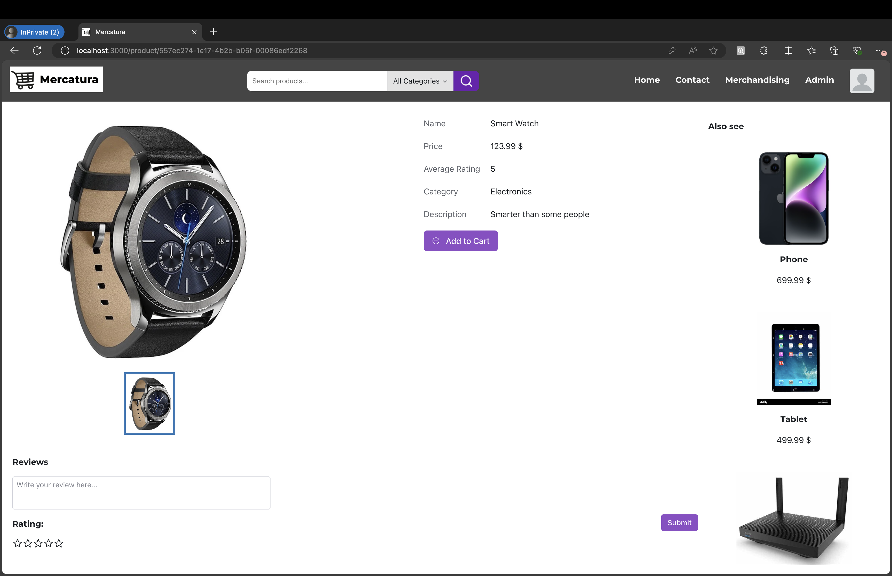 

#### Reviews
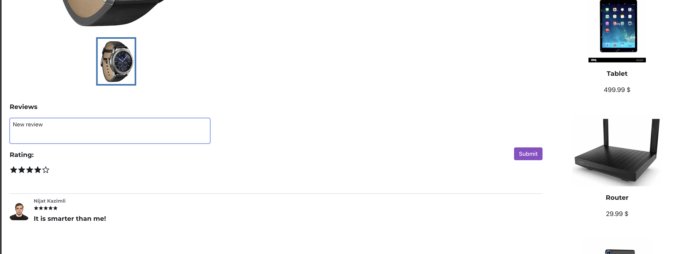 

#### Add to cart
If you do not have any carts, do not worry. You can create one here. 
If the item is already in the cart, you cannot add it again. 
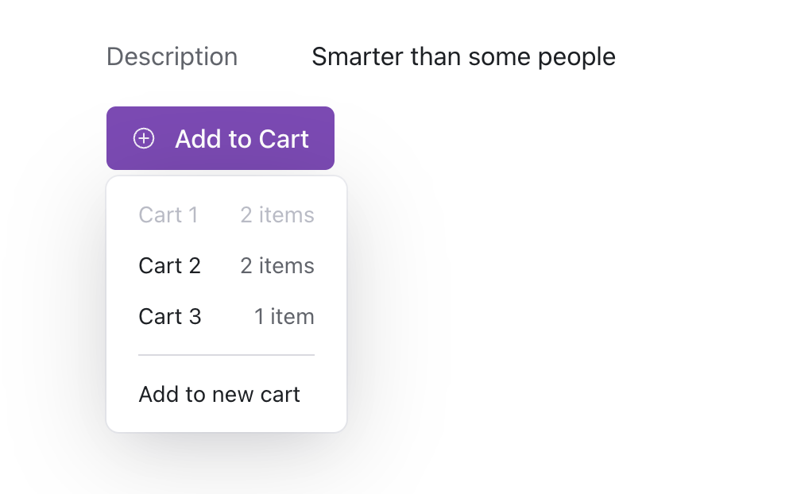 

### Profile Photo Context Menu
Here the user can access profile, carts pages, and logout 
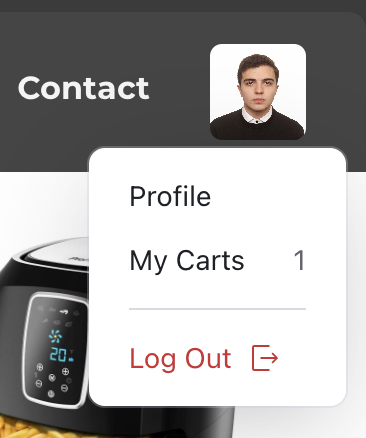 

### Carts
Here the user can create a new cart, see all the cart details, pay them, see items, or even delete. 
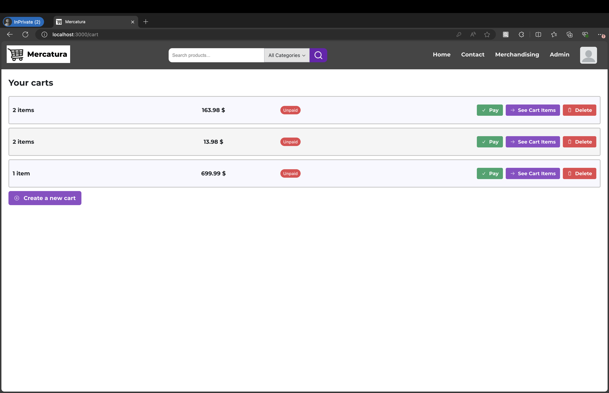 

#### Cart Items
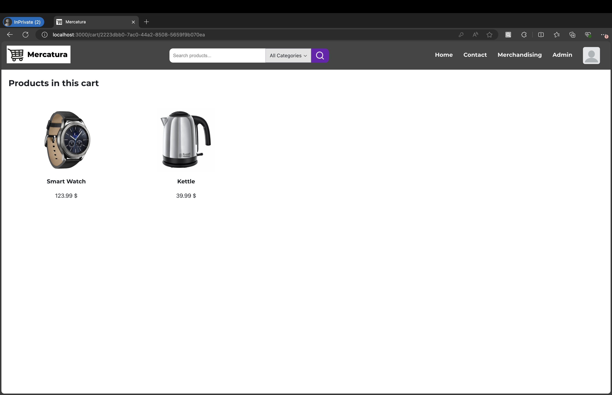 

### Profile Page
Here the user can change his/her profile picture or password, logout, or even delete the account.
 

### Merchandising Page
Here the merchandiser can add products, categories, photos for the products, or delete the products. 
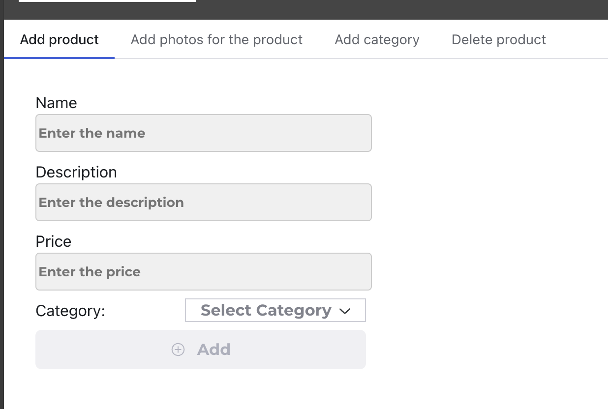 

### Admin Page
Here the admin can see numerous statistics about users, carts, and products in a chart or table form. 
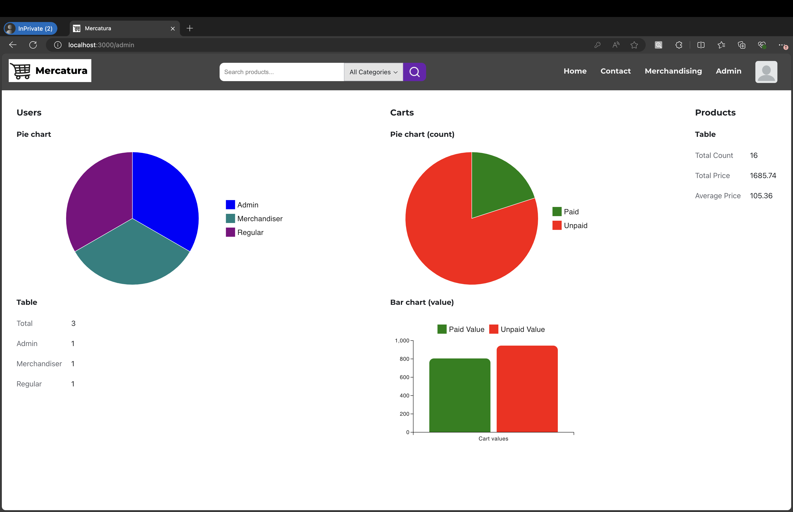 

### Contact Page
Here the user can see my contact details. 
 
